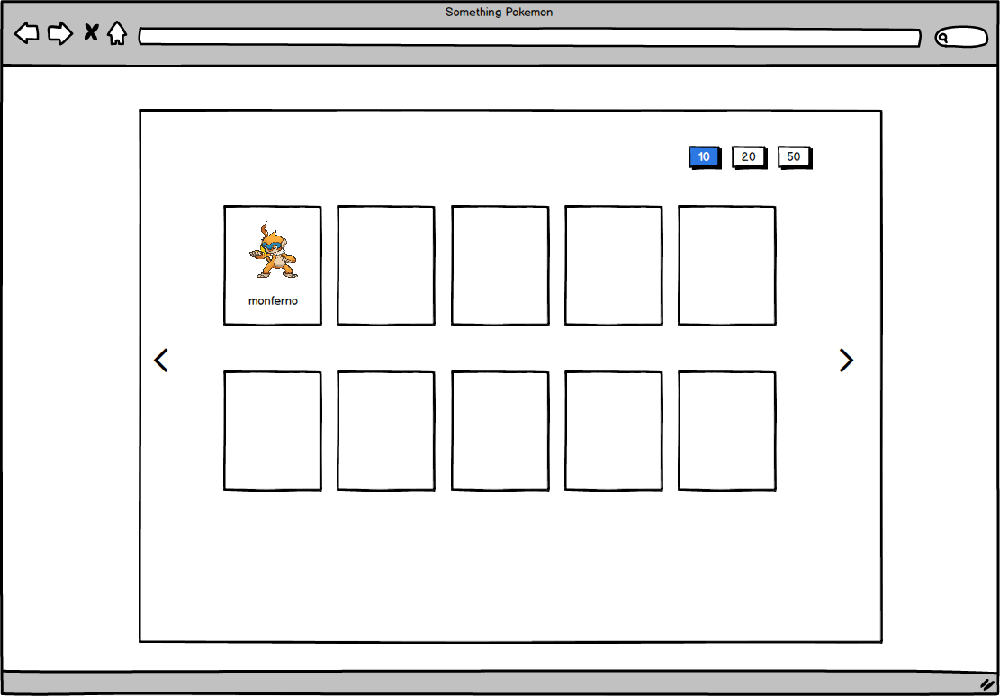
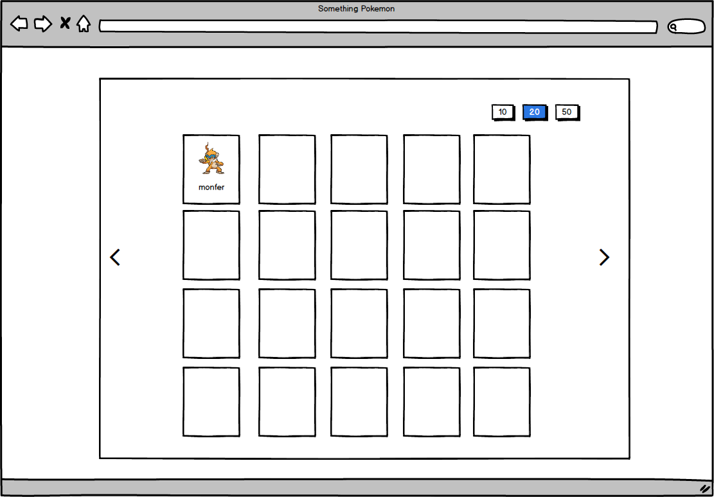
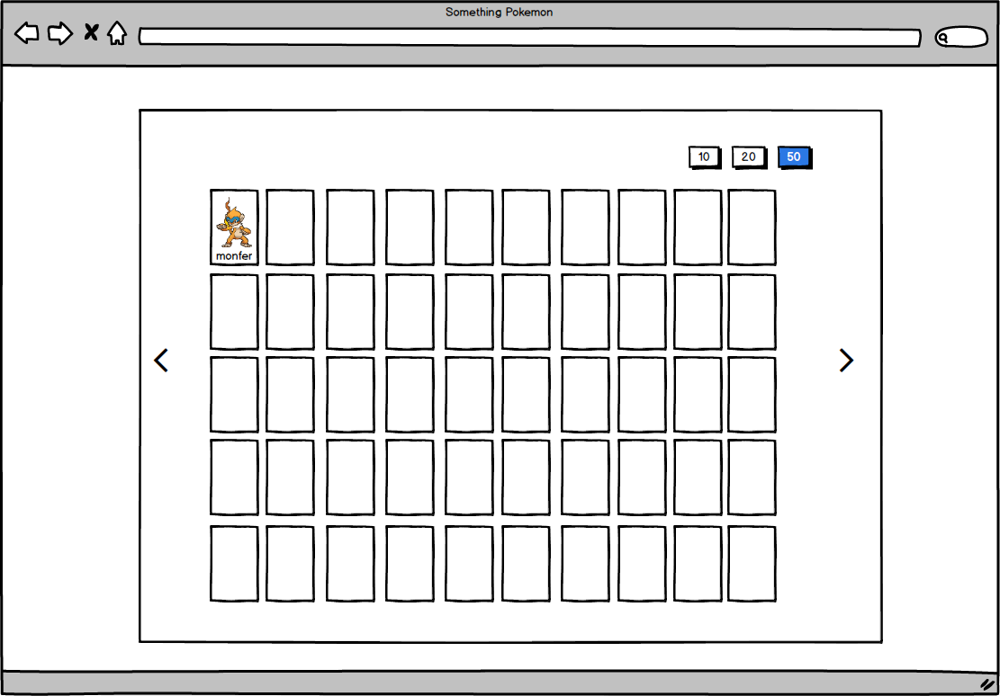

# challenge-nida
Something about Pokémons

### Start
```
yarn install
yarn develop
```

### Available npm commands
```
yarn test
yarn test:coverage
yarn develop
yarn prod
yarn clean
```

##### Wireframes






##### Techs

React + Redux + reselect

###### Run


